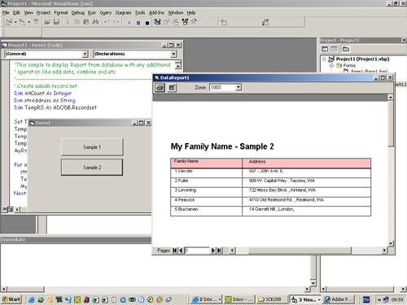



## Datareport Without DataEnvironment

### Description

This my sample how to Use Datareport without using Data Environment. Also include how to manipulate data before show it with Datareport.

All generate by Coding. Look up sample 1 and sample 2 inside my program.

Dont forget to vote for me
 
### More Info
 

             |
---                |---
**Submitted On**   |2003-07-28 22:03:02
**By**             |[Hanafiah](https://github.com/Planet-Source-Code/PSCIndex/blob/master/ByAuthor/hanafiah.md)
**Level**          |Intermediate
**User Rating**    |4.7 (47 globes from 10 users)
**Compatibility**  |VB 6\.0
**Category**       |[Coding Standards](https://github.com/Planet-Source-Code/PSCIndex/blob/master/ByCategory/coding-standards__1-43.md)
**World**          |[Visual Basic](https://github.com/Planet-Source-Code/PSCIndex/blob/master/ByWorld/visual-basic.md)
**Archive File**   |[Datareport1621097282003\.zip](https://github.com/Planet-Source-Code/hanafiah-datareport-without-dataenvironment__1-47232/archive/master.zip)

